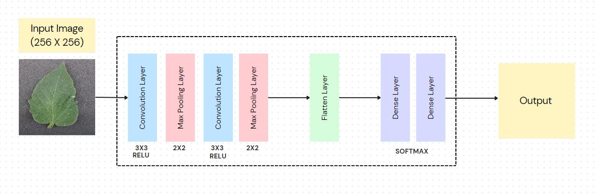
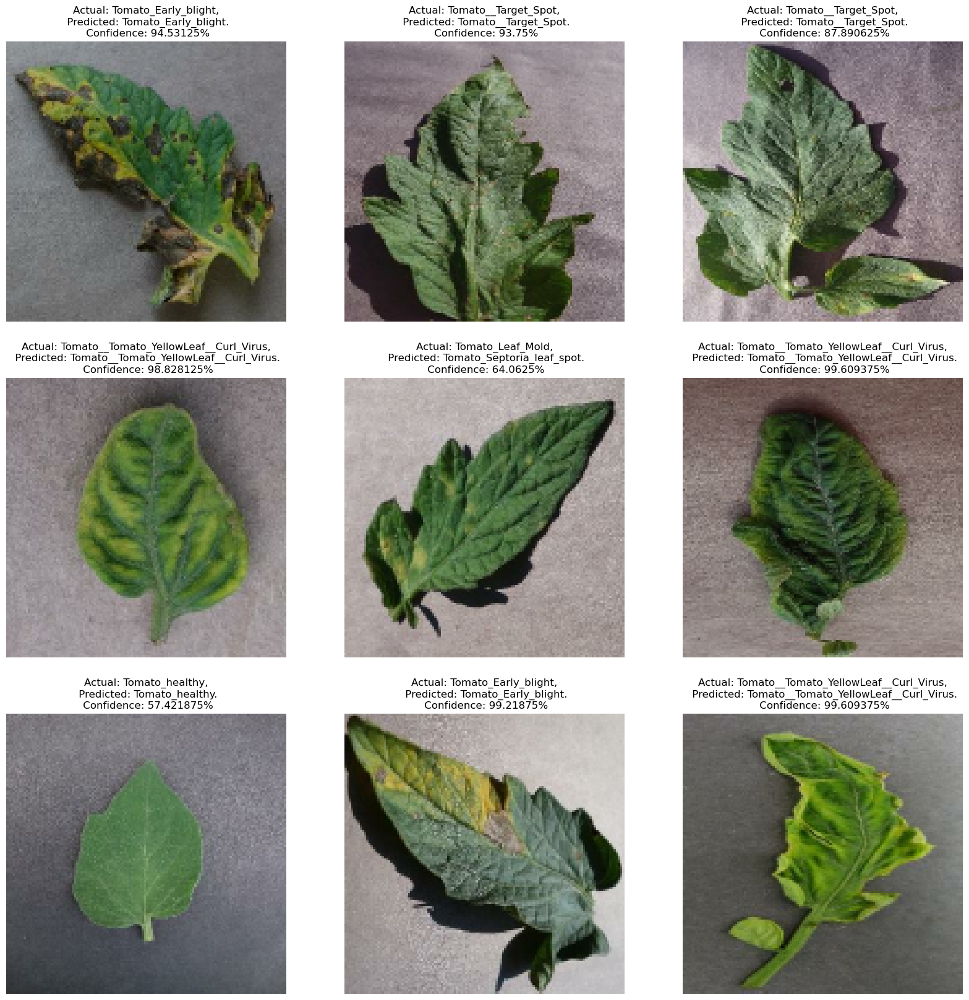

# Tomato Plant Disease Detection using TinyML

## Description
This project focuses on developing a lightweight machine learning model using **TinyML techniques** to detect tomato plant diseases from leaf images in real-time. Leveraging **TensorFlow Lite** and **Edge Impulse**, the model operates directly on edge devices, providing immediate insights for agricultural decision-making. With a dataset of **16,011 images** spanning **10 disease categories**, the model undergoes rigorous preprocessing, augmentation, and optimization. Real-world testing validates its effectiveness, offering farmers a convenient tool for on-site disease diagnosis, potentially transforming agricultural practices.

---

## Shortcomings
- **Limited Dataset**: Despite augmentation efforts, the dataset may lack comprehensive representation of environmental factors influencing disease manifestation.
- **Dependency on Image Quality**: Variations in image quality, such as lighting conditions and camera resolution, could hinder model performance in real-world scenarios.
- **Connectivity Limitations**: Rural areas with limited connectivity face challenges in timely updates and maintenance, affecting the effectiveness of edge-based models.

---

## Possible Future Extensions
- **Multi-Crop Expansion**: Extending the model to support various crops enhances its utility for diverse agricultural needs.
- **Mobile App Integration**: Developing a user-friendly mobile app enables farmers to diagnose diseases on the go, promoting accessibility.
- **Sensor Data Integration**: Incorporating environmental sensor data (e.g., temperature, humidity) improves disease detection accuracy by accounting for external factors affecting plant health.

---

## Dataset Used
- **[Plant Disease Dataset](https://www.kaggle.com/datasets/emmarex/plantdisease)**: Contains 16,011 tomato leaf images across 10 disease categories.

---

## Key Features
- **Dataset**: Plant Village dataset with 16,011 images categorized into 10 tomato leaf diseases.
- **Methodology**: Includes data preprocessing, model development, conversion, deployment, evaluation, and validation.
- **Results**: Achieved an accuracy of **89.6%** in disease identification.
- **Expected Outcomes**: 
  - Lightweight, high-performing ML model.
  - Successful deployment on edge devices.
  - Effective real-world disease diagnosis.
- **Real-World Use**: Real-time plant health predictions via the **Edge Impulse app** on mobile devices.

---

## Input Images


---

## Model Overview


---

## Output
  
  

  


---

## Technology Stack
- **TensorFlow**
- **TensorFlow Lite**
- **Edge Impulse**
- **Python**

---

## How to Use
1. Clone the repository:  
   ```bash
   git clone https://github.com/its-kumar-yash/Tomato-Plant-Disease-Detection-Model.git
